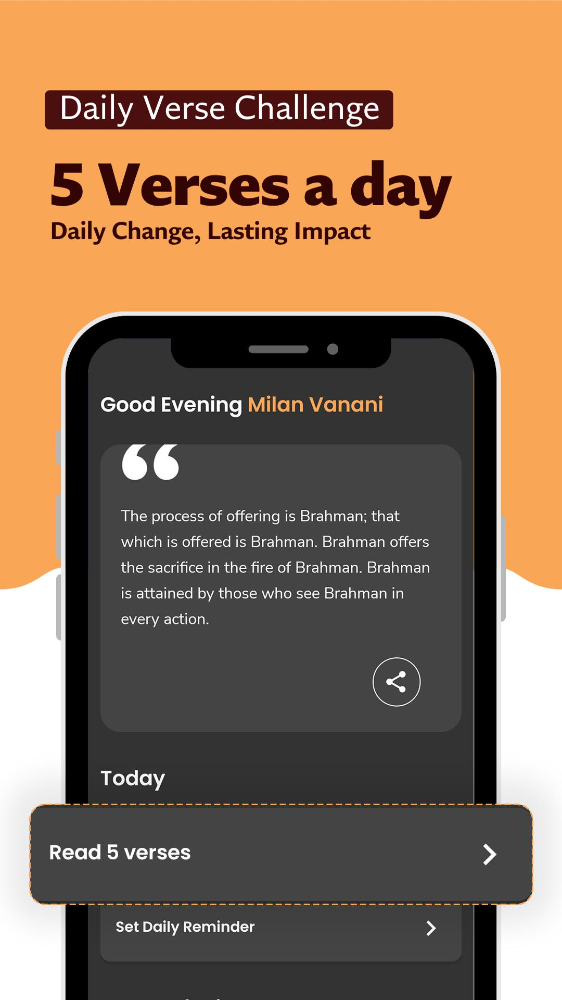
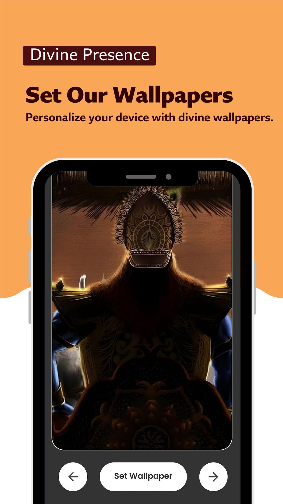
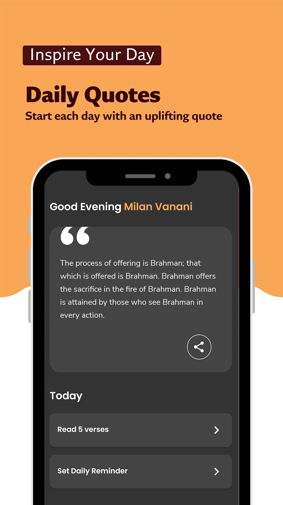
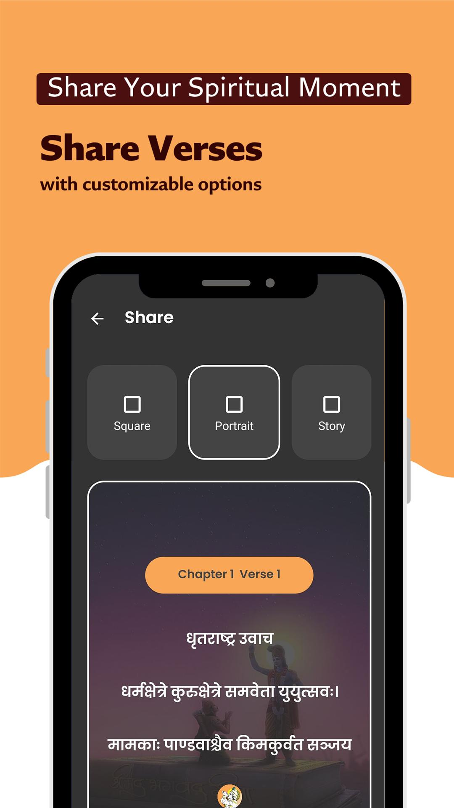
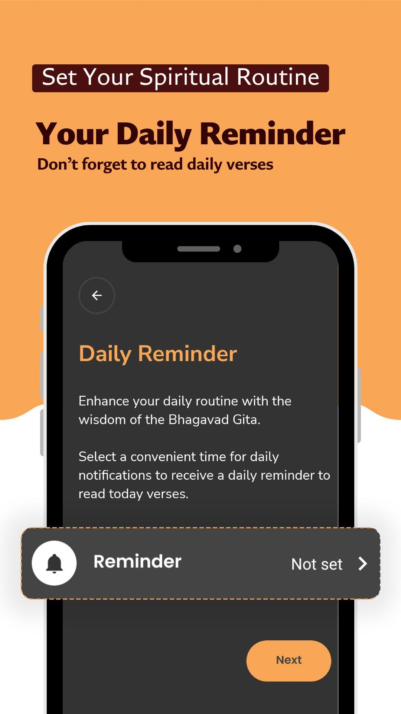

# Bhagvad Gita App ( React Native )

# API Integration

You can get your API keys from here for free - [RapidAPI Bhagavad Gita](https://rapidapi.com/bhagavad-gita-bhagavad-gita-default/api/bhagavad-gita3/playground/apiendpoint_01f756ff-a6ee-421e-bf25-1882974c4857).

# Screen Shots

 
